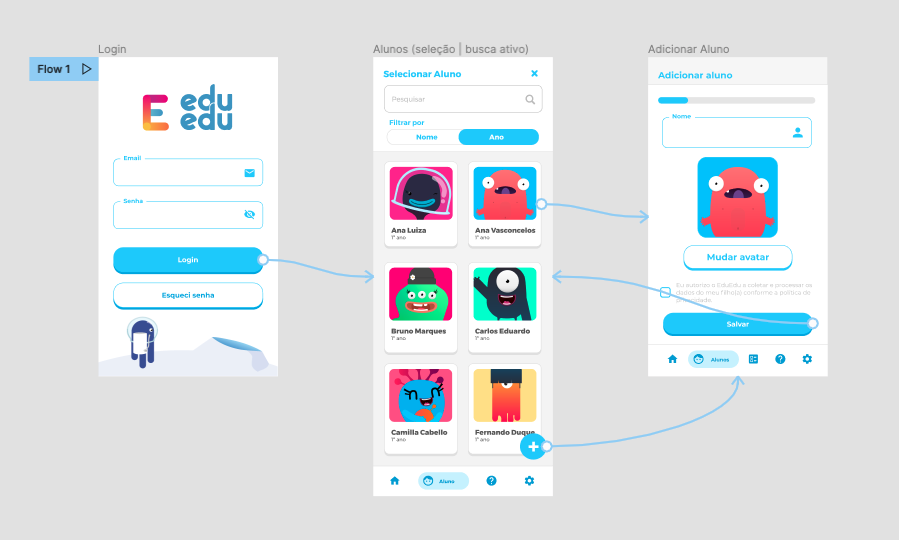

    

# Bem vind@ ao Instituto ABCD!

Olá! Somos uma organização social que se **dedica a melhorar a qualidade de vida** de pessoas com **dislexia** e **dificuldades de aprendizagem**.

Nosso app conta com avaliação média acima de **4.8 estrelas na Google Play e +1M de downloads**, temos uma comunidade de usuários engajados e testamos rapidamente novas ideias!

Se você chegou até o desafio técnico, meus parabéns! Siga as instruções abaixo e ao final do teste retorne o email com o  **link do seu repositório**, boa sorte e até a próxima etapa! 

# Sobre o desafio

Este é um teste onde você deve ser capaz de escrever uma aplicação android, usando as telas fornecidas como referência. 

Estamos buscando por um projeto bem organizado e que contemple a maioria dos itens abaixo. Caso não seja possível realizar tudo, mande mesmo assim!

## Tarefa

Usando as telas ([FIGMA](https://www.figma.com/file/gYQrOIzU65GJhgdkRztkRd/Android-Desafio)) fornecidas como referência, você irá precisar construir a aplicação e os componentes necessários utilizando Kotlin, arquitetura MVVM, padrão repository, coroutines e utilizar do Firebase para armazenar os dados e  autênticação. 

Não esqueça de incluir um README com instruções de *setup*, e qualquer teste ou outra documentação que você criou como parte da sua solução.

Você pode usar de outras tecnologias, como injeção de depencia, ou libs que desejar, uma vez que consiga nos explicar a motivação de as ter escolhido (pontos extras!).

 

## Design

  
 

 

As telas acima você encontra no [FIGMA](https://www.figma.com/file/gYQrOIzU65GJhgdkRztkRd/Android-Desafio). As métricas de design devem ser seguidas. 

Os assets você encontra na pasta [assets](./assets) ou pode extrair, direto do Figma.

Encorajamos que você use as ferramentas do [Jetpack](https://developer.android.com/jetpack/androidx/explorer) (Jetpack Compose é super bem vindo!) e [Firebase](https://firebase.google.com/products-build), além de testes unitários e/ou interface.

 

## Detalhes

#### 1. Autenticação

 - [ ] O login deve ser feito utilizando Firebase Auth.
 - [ ] Apenas usuários autenticados podem acessar as outras telas do app.

#### 2. Listagem de Crianças

 - [ ] A listagem de crianças consulta uma coleção no Firebase Firestore.
 - [ ] Ordenar por nome e/ou ano escolar.
 - [ ] Os cards devem conter: **Imagem, Nome da criança e Ano escolar**.
 - [ ] Os assets de avatars são carregados do FireStorage.

 Para a funcionalidade de busca:
- [ ] Deve filtrar os alunos previamente cadastrados.
- [ ] Deve iniciar a filtragem após digitar 3 caracteres.

#### 3. Cadastro de criança
- [ ] Deve permitir alterar o avatar da criança.
- [ ] Todos os campos devem estar preenchidos e o checkbox de aceite de termos ativado para que o usuário consiga cadastrar uma criança.
- [ ] Ao cadastrar é exibida a listagem de crianças atualizada.

 
 

## Interessante possuir

Estes não são obrigatórios, mas será um grande plus se você implementar. Aqui estão algumas sugestões que gostaríamos de ver:

- Implementar a solução usando Jetpack Compose.

- Implementar a solução usando o padrão arquitetural MVVM.

- Mostrar seu progresso pelo bom uso do git commit history.

- Código preparado para produção (clean, maintainable, reusable code)

- Implementação de testes unitários e/ou interface.
 

## Submissão

* Por favor, submeta seu código enviando o link do repositório por email.
* Não esqueça de incluir um README com instruções de *setup*, e qualquer teste ou outra documentação que você criou como parte da sua solução.
 

## Tabela de Pontos do Projecto

Iremos quantificar o projeto de acordo com as tabelas abaixo.

Antes de tudo, os projetos dos candidatos devem ter todos os requerimentos da tabela base.
 

| Requerimentos base| Pontos |          
| --- | --- |
| Funcionalidades | 10 Pontos por tela completa |
| Firebase (Auth, FireStore, FireStorage) | 20 Pontos |
| Libs pacote Jetpack (navigation, coroutine, etc...) | 5 Pontos por lib |
| Estruturação de pastas e arquivos do projeto | 5 Pontos |
 

| Bonus   | Pontos |          
| --- | --- |
| Cada funcionalidade extra | 5 Pontos |
| Utilizar o lottie na tela de login | 5 Pontos |
| Jetpack Compose | 15 Pontos |
| Git commit history| 10 Pontos |
| Testes unitários e/ou testes de interface por tela | 20 Pontos |
